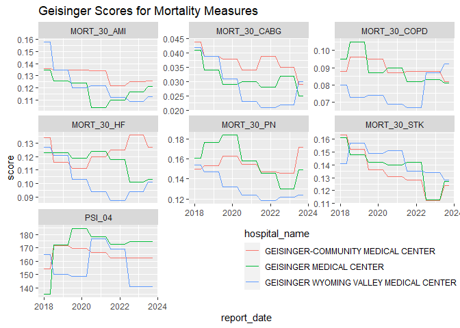

<!-- README.md is generated from README.Rmd. Please edit that file -->

# hospitalstars

<!-- badges: start -->
<!-- badges: end -->

CMS issues star ratings annually for hospitals, and they make the *data*
([Care Compare
reports](https://data.cms.gov/provider-data/archived-data/hospitals))
and the *algorithm* ([SAS
package](https://qualitynet.cms.gov/inpatient/public-reporting/overall-ratings/sas))
publicly available. However, that can be difficult to work with because
the data is spread out over dozens of archives of CSV files, and the
algorithm is implemented with SAS.

The hospitalstars package has an R implementation of the most recent
(April 2021 & July 2022) versions of the SAS package, and prepared input
data from each quarterly Care Compare report from January 2018 through
April 2023.

## Installation

Before installing this package on Windows, you need to download and
install [RTools](https://cran.r-project.org/bin/windows/Rtools/) for
your version of R. If RStudio is open, you may need to restart it.

This has only been tested on Windows and Ubuntu. The two steps to
install there are:

1.  Install the devtools package.
2.  Install the development version of hospitalstars with the command
    below.

``` r
devtools::install_github("jimurick/hospitalstars")
```

## Hospital and Measure Info

The table `hospitalstars::hospital_info_df` has basic information for
each hospital.

``` r
library(hospitalstars)

hospital_info_df[1:5, c("PROVIDER_ID", "hospital_name")]
#>   PROVIDER_ID                   hospital_name
#> 1      010001 SOUTHEAST HEALTH MEDICAL CENTER
#> 2      010005        MARSHALL MEDICAL CENTERS
#> 3      010006    NORTH ALABAMA MEDICAL CENTER
#> 4      010007        MIZELL MEMORIAL HOSPITAL
#> 5      010008     CRENSHAW COMMUNITY HOSPITAL
```

The next chunk pulls 3 of Geisinger’s bigger hospitals.

``` r
suppressWarnings(library(tidyverse))

geisinger_df <-
  hospital_info_df %>%
  filter(grepl("GEISINGER.*CENTER$", hospital_info_df$hospital_name))
  
geisinger_df %>%
  select(PROVIDER_ID, hospital_name)
#>   PROVIDER_ID                           hospital_name
#> 1      390001      GEISINGER-COMMUNITY MEDICAL CENTER
#> 2      390006                GEISINGER MEDICAL CENTER
#> 3      390270 GEISINGER WYOMING VALLEY MEDICAL CENTER
```

There’s also a table `measure_info_df` with one row for each combination
of a measure appearing in a Care Compare report. The column
`report_date` gives the first day of the month that the Care Compare
report was released.

This chunk shows the 7 mortality measures and their IDs. Some measure
names are a little long, so they’re limited to 60 characters here.

``` r
mortality_df <-
  measure_info_df %>%
  filter(report_date == "2023-10-01", measure_group == "Mortality")

mortality_df %>%
  transmute(measure_id, measure_name = str_sub(measure_name, end = 60))
#>     measure_id                                                 measure_name
#> 1  MORT_30_AMI      Acute Myocardial Infarction (AMI) 30-Day Mortality Rate
#> 2 MORT_30_CABG 30-Day All-Cause Mortality Following Coronary Artery Bypass 
#> 3 MORT_30_COPD Chronic Obstructive Pulmonary Disease (COPD) 30-Day Mortalit
#> 4   MORT_30_HF                     Heart Failure (HF) 30-Day Mortality Rate
#> 5   MORT_30_PN                              Pneumonia 30-Day Mortality Rate
#> 6  MORT_30_STK            Acute Ischemic Stroke (STK) 30-Day Mortality Rate
#> 7       PSI_04 Death rate among surgical inpatients with serious treatable
```

## Historical Measure Data

The function `historical_measure_data()` pulls historical scores for
each quarter since January 2018 for the given hospitals and measures.

``` r
mortality_history_df <-
  historical_measure_data(
    measure_ids = mortality_df$measure_id,
    provider_ids = geisinger_df$PROVIDER_ID
  )

mortality_history_df %>% head()
#>    report_date PROVIDER_ID  measure_id score
#> 1:  2018-01-01      390001 MORT_30_AMI 0.136
#> 2:  2018-01-01      390006 MORT_30_AMI 0.135
#> 3:  2018-01-01      390270 MORT_30_AMI 0.158
#> 4:  2018-05-01      390001 MORT_30_AMI 0.136
#> 5:  2018-05-01      390006 MORT_30_AMI 0.135
#> 6:  2018-05-01      390270 MORT_30_AMI 0.158
```

The format of this data is easy to use with ggplot.

``` r
geis_names_df <-
  geisinger_df %>%
  select(PROVIDER_ID, hospital_name)

mortality_history_df %>%
  inner_join(geis_names_df, by = "PROVIDER_ID") %>%
  ggplot(aes(report_date, score,
             group = hospital_name, color = hospital_name)) +
  geom_line() +
  facet_wrap(~measure_id, scales = "free_y") +
  theme(legend.position = c(0.75, 0.15)) +
  ggtitle("Geisinger Scores for Mortality Measures")
```



## Star Rating Algorithm

In order to calculate star ratings, you need an input table with all
hospitals’ data. The `star_rating_input()` function returns a data.frame
made of Care Compare data. Its argument `report_date` specifies the
first day of the month the Care Compare report was released.

Then `compute_star_scores()` will calculate the star ratings (using the
July 2023 version by default). The results are returned in a copy of the
input table with extra columns added.

``` r
input_df <- star_rating_input(report_date = "2023-01-01")
output_df <- compute_star_scores(input_df)

output_df %>%
  filter(PROVIDER_ID %in% geisinger_df$PROVIDER_ID) %>%
  select(PROVIDER_ID, peer_group = n_groups, summary_score, stars)
#>   PROVIDER_ID peer_group summary_score stars
#> 1      390001          5    0.09732463     4
#> 2      390006          5    0.30614614     4
#> 3      390270          5    0.35972998     4
```

`hospitalstars` also includes a copy of the SAS Package’s output, which
was computed in SAS.

``` r
sas_package$v202307$output_df %>%
  select(
    PROVIDER_ID, peer_group = Total_measure_group_cnt,
    summary_score, stars = star
  ) %>%
  filter(PROVIDER_ID %in% geisinger_df$PROVIDER_ID)
#>   PROVIDER_ID peer_group summary_score stars
#> 1      390001          5    0.09956553     4
#> 2      390006          5    0.30740967     4
#> 3      390270          5    0.36152747     4
```

It may be interesting to note that the results in the last two code
chunks above are not the same, because the SAS Package’s input file has
some differences with the Care Compare report from July 2021 (the data
used for the 2022 Star Ratings). If you use the SAS Package’s input file
in R here, you should get the same output as you would in SAS.

``` r
compute_star_scores(sas_package$v202307$input_df) %>%
  filter(PROVIDER_ID %in% geisinger_df$PROVIDER_ID) %>%
  select(PROVIDER_ID, peer_group = n_groups, summary_score, stars)
#>   PROVIDER_ID peer_group summary_score stars
#> 1      390001          5    0.09956553     4
#> 2      390006          5    0.30740967     4
#> 3      390270          5    0.36152747     4
```

To see the specific measure values where the two disagree, you could use
a query like this, which counts how many disagreements there are by
measure.

``` r
r_unpivoted_df <- input_df %>%
  pivot_longer(-PROVIDER_ID, names_to = "measure_id", values_to = "score_r")
sas_unpivoted_df <- sas_package$v202307$input_df %>%
  pivot_longer(-PROVIDER_ID, names_to = "measure_id", values_to = "score_sas")

r_unpivoted_df %>%
  full_join(sas_unpivoted_df, by = c("PROVIDER_ID", "measure_id")) %>%
  mutate(
    score_r = replace_na(score_r, -1000),
    score_sas = replace_na(score_sas, -1000)
  ) %>%
  filter(score_r != score_sas) %>%
  filter(!grepl("(NUMB_COMP|RATE_P|_DEN|_DEN_PRED)$", measure_id)) %>%
  count(measure_id) %>%
  arrange(desc(n)) %>%
  head()
#> # A tibble: 6 × 2
#>   measure_id       n
#>   <chr>        <int>
#> 1 OP_18B         478
#> 2 IMM_3          133
#> 3 HCP_COVID_19   131
#> 4 OP_22          111
#> 5 OP_13          110
#> 6 OP_29          101
```

## What-if Analysis

Suppose we wanted to see how improving mortality scores would change the
final star ratings.

We’ll reuse the `input_df` dataframe created in [Star Rating
Algorithm](#star-rating-algorithm) above. The current mortality scores
are

``` r
input_df %>%
  inner_join(geis_names_df, by = "PROVIDER_ID") %>%
  select_at(c("hospital_name", mortality_df$measure_id))
#>                             hospital_name MORT_30_AMI MORT_30_CABG MORT_30_COPD
#> 1      GEISINGER-COMMUNITY MEDICAL CENTER       0.125        0.035        0.088
#> 2                GEISINGER MEDICAL CENTER       0.117        0.032        0.083
#> 3 GEISINGER WYOMING VALLEY MEDICAL CENTER       0.109        0.022        0.087
#>   MORT_30_HF MORT_30_PN MORT_30_STK PSI_04
#> 1      0.136      0.146       0.112 162.13
#> 2      0.101      0.130       0.113 174.50
#> 3      0.094      0.122       0.134 140.58
```

Create a new input table where those scores are improved by 5%.

``` r
improvement <-
  ifelse(input_df$PROVIDER_ID %in% geisinger_df$PROVIDER_ID, 0.95, 1)

new_input_df <- input_df
for (m_id in mortality_df$measure_id)
  new_input_df[[m_id]] <- new_input_df[[m_id]] * improvement

new_input_df %>%
  inner_join(geis_names_df, by = "PROVIDER_ID") %>%
  select_at(c("hospital_name", mortality_df$measure_id))
#>                             hospital_name MORT_30_AMI MORT_30_CABG MORT_30_COPD
#> 1      GEISINGER-COMMUNITY MEDICAL CENTER     0.11875      0.03325      0.08360
#> 2                GEISINGER MEDICAL CENTER     0.11115      0.03040      0.07885
#> 3 GEISINGER WYOMING VALLEY MEDICAL CENTER     0.10355      0.02090      0.08265
#>   MORT_30_HF MORT_30_PN MORT_30_STK   PSI_04
#> 1    0.12920     0.1387     0.10640 154.0235
#> 2    0.09595     0.1235     0.10735 165.7750
#> 3    0.08930     0.1159     0.12730 133.5510
```

Then recompute the star scores.

``` r
new_output_df <- compute_star_scores(new_input_df)

new_output_df %>%
  inner_join(geis_names_df, by = "PROVIDER_ID") %>%
  select(hospital_name, peer_group = n_groups, summary_score, stars)
#>                             hospital_name peer_group summary_score stars
#> 1      GEISINGER-COMMUNITY MEDICAL CENTER          5     0.2187725     4
#> 2                GEISINGER MEDICAL CENTER          5     0.4196913     5
#> 3 GEISINGER WYOMING VALLEY MEDICAL CENTER          5     0.4658343     5
```

So improving all 7 Mortality scores by 5% changed the overall star
ratings from 4, 4 and 4 to 4, 5 and 5.
